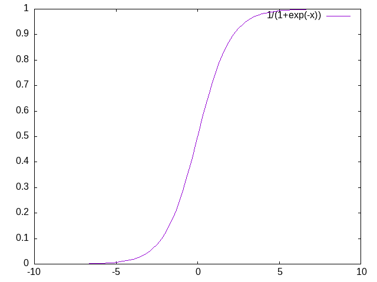

# Logistic Regression 

---

## The Basic Setup

We have **structured** data (column data):

<div class="fragment">
```
V1      V2      V3     V4   V5      V12  V13     Y
3.89	4.18	0.6	 6.68	5.0	...	0.4	 1.7148	 1
3.89	0.00	0.2	 4.83	5.0	...	0.4	 0.5108	 0
3.89	0.51	0.2	 0.74	5.0	...	0.4	 0.3096	 0
3.89	0.00	0.2	10.80	6.0	...	0.4	 3.5060	 1
3.89	0.00	0.2	 0.08	5.0	...	0.4	 0.2832	 0
...	    ...	    ...	  ...	...	...	...	    ...	 ...
5.57	0.49	0.2	 0.89	5.0	...	0.4	 0.3156	 0
```
</div>

<div class="fragment">
This time our response variable is binary: 0 or 1.
</div>

## The Model

<div class="fragment">
$$ y^{(i)} \approx \sigma(\alpha\cdot x^{(i)} + \beta) = \sigma(\theta\cdot x^{(i)}) $$
where $\sigma(x)=1/(1+e^{-x})$



</div>

## The Likelihood Model

<div class="fragment">
$$ p(x^{(i)}|y^{(i)}=1) = \sigma(\theta\cdot x^{(i)}) $$
</div>
<div class="fragment">
$$ p(x^{(i)}|y^{(i)}=0) = 1 - \sigma(\theta\cdot x^{(i)}) $$
</div>

## From Likelihood to Cost

<div class="fragment">
$$ cost^{(i)}(\theta) = -y^{(i)}\log \sigma(\theta\cdot x^{(i)}) - (1-y^{(i)})\log (1-\sigma(\theta\cdot x^{(i)})) $$
</div>
<div class="fragment">
$$ cost(\theta) =  - \sum_i y^{(i)}\log \sigma(\theta\cdot x^{(i)}) + (1-y^{(i)})\log (1-\sigma(\theta\cdot x^{(i)})) $$
</div>

## Find the Best Parameter via Optimization

Find the best $\theta$
$$ \theta_0 = argmin_\theta cost(\theta) $$

## DEMO

# Support Vector Machines

## The Setup and The Data

+ [SVM](https://en.wikipedia.org/wiki/Support_vector_machine) is a supervised binary classification algorithm.
+ Dataset $\{x^{(i)},y^{(i)}\}$ consists of 
   - points $x^{(i)}\in\mathbb{R}^n$ 
   - $y^{(i)}\in\{-1,1\}$.

## The Main Idea


## The Main Idea

In the simplest version, 

+ the data is linearly separable 
+ there is a hyperplane that sits in between 
+ aim is to find a hyperplane with *the largest margin*
+ the margin is the gap between separating hyperplane 

## Some Linear Algebra

+ Every hyperplane is determined by 
  - a normal vector $w$ and 
  - a displacement $b$ 
+ The separating hyperplane: $w\cdot x + b = 0$
+ $H_\epsilon = \{ x^{(i)}\in\mathbb{R}^n\mid sgn(w\cdot x + b) = \epsilon \}$

## The Cost Function 

+ Support Vectors: $w\cdot x^{(i)} + b = \pm 1$
+ Gap: $2/\|w\|$.
+ Best model maximizes the gap
+ Equivalently minimizes $\|w\|$.


## DEMO

