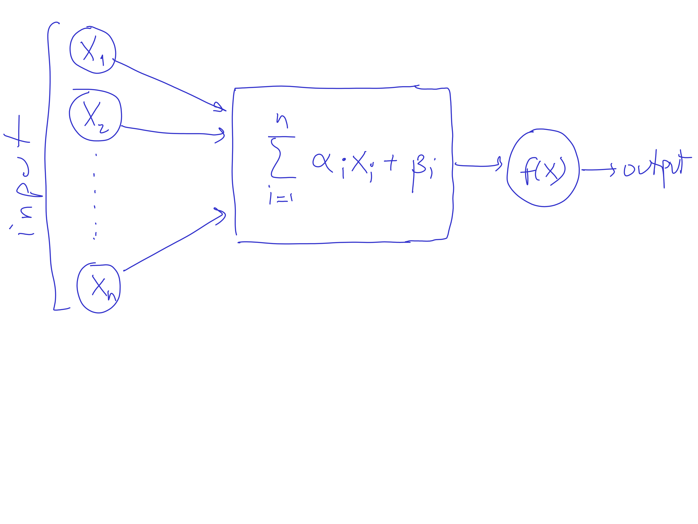
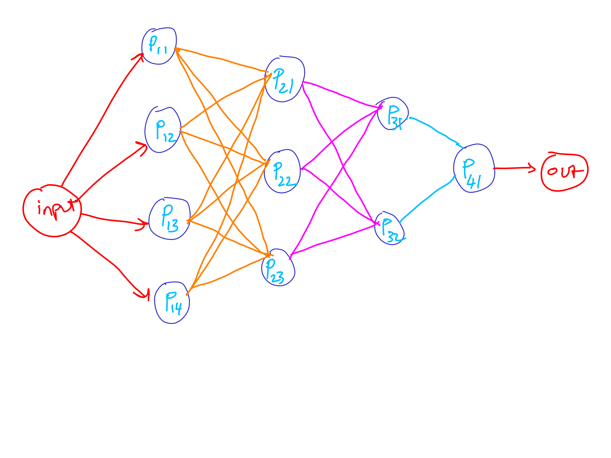
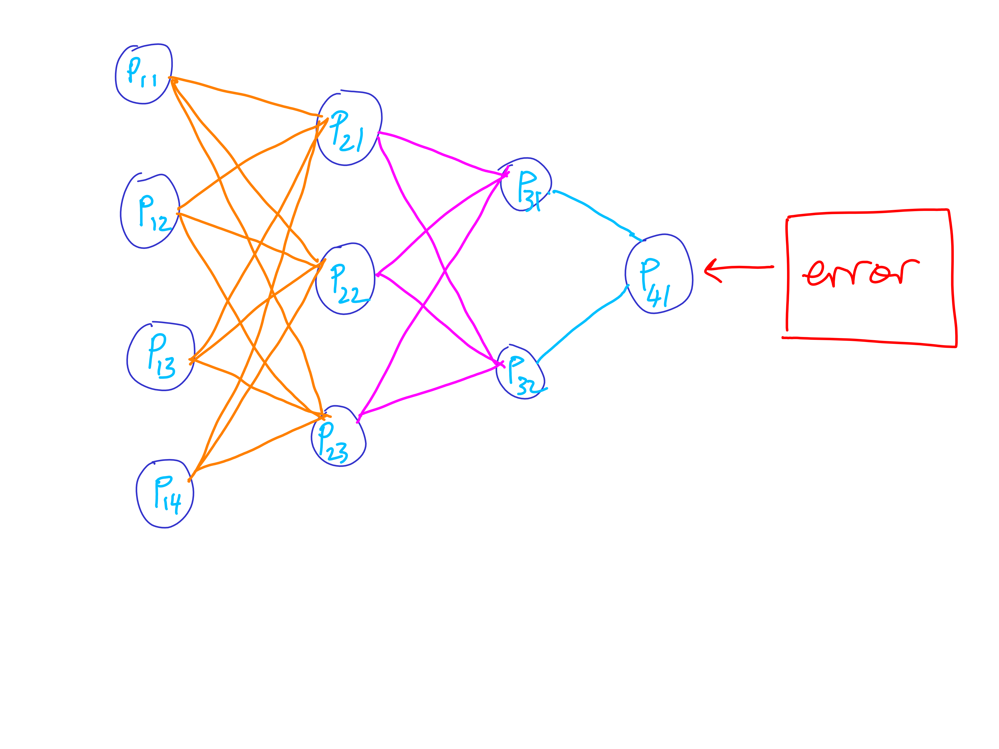

# Neural Networks

Neural networks consists of perceptrons linked together on a computation graph.

------

## Perceptron

The fundamental unit of a neural network is a perceptron.

------

## Perceptron

A perceptron 

1. takes its vector input 
2. multiplies it with a weight 
3. adds a bias
4. pass it through an activation function

$$ f(\alpha\cdot v + \beta) $$

-------

## Perceptron

This should look, feel and sound familiar because this is logistic
regression.

-------

## Computation Graph

-----------------------------

## Computation Graph

A computation graph is a network of perceptrons. Computation from
input to output is called **forward propagation**.

-----------------------------

## Backward Propagation

The weights in individual perceptrons in a computation graph
are initially set randomly. 

-----------------------------

## Backward Propagation

----------------------------

## Backward Propagation

For each input:

* we calculate the error
* we push it backward
* update the weights to counter-balance the error

-----------------------------

# Types of Neural Networks

Types of the Neural Networks is determined by its inputs:

-----------------------------

## Input types

+ Vector inputs
+ Matrix inputs
+ Time series inputs

-----------------------------

## Network types

+ Ordinary Neural Networks
+ Convolutional Neural Networks
+ Recurrent Neural Networks

-----------------------------

### Ordinary Neural Networks

Just a computational graph given by a network of perceptrons.

-----------------------------

### Convolutional Networks

Convolutional networks work well with matrix inputs such as images.

Source: [Machines that can see: Convolutional Neural Networks](https://shafeentejani.github.io/2016-12-20/convolutional-neural-nets/)

-----------------------------

### Convolution

Source: [Convolutional neural networks (CNN) tutorial](https://jhui.github.io/2017/03/16/CNN-Convolutional-neural-network/)

-----------------------------

### Recurrent Neural Networks

Source: [Understanding LSTM Networks](http://colah.github.io/posts/2015-08-Understanding-LSTMs/)

-----------------------------

## Demo
